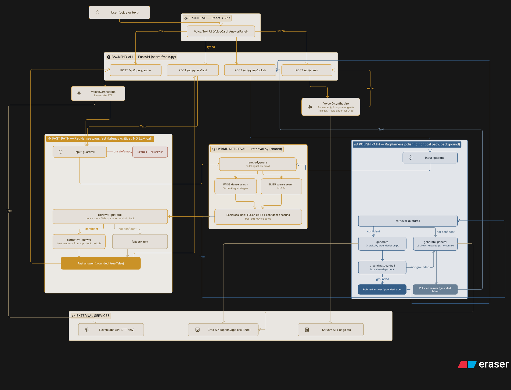

# Vaani - Ask in Your Language

Voice in → ElevenLabs STT → guardrail → chunked/embedded hybrid retrieval (FAISS dense + BM25 sparse, fused via RRF) → an instant extractive answer (no LLM) → Sarvam/edge-tts TTS → voice out. A Groq LLM-polished answer is generated separately, off the response-latency critical path, mirroring the on-demand TTS pattern. Orchestrated as a LangGraph state machine.

Built for the HH Goa 2026 Task 2 spec, on the [ai4bharat/MSMARCO-XI](https://huggingface.co/datasets/ai4bharat/MSMARCO-XI) dataset — **all 14 languages** (Assamese, Bengali, Gujarati, Hindi, Kannada, Malayalam, Marathi, Nepali, Odia, Punjabi, Sanskrit, Tamil, Telugu, Urdu) indexed into one multilingual corpus per chunking strategy.

## System Architecture

How a question actually moves through the system — the fast extractive answer (in the latency-critical path) and the LLM-polished one (fetched separately, off it) both re-run the same hybrid retrieval, just diverge after `retrieval_guardrail`:



**Hybrid Retrieval** is genuinely one shared implementation (`retrieval.retrieve_best_strategy`) — both the Fast Path and the Polish Path call it independently rather than sharing a cached result, same reason `VoiceIO.synthesize` re-derives from raw text with no server-side session state. The two paths are drawn separately because they're two distinct LangGraph traversals (`polish` compiles the *original* full graph — guardrails → generate → grounding guardrail — while `run_fast` is a shorter hand-rolled sequence, not a compiled graph at all), even though both are built from the same `_node_input_guardrail`/`_node_retrieval_guardrail` methods on `RagHarness`.

### A dataset quirk worth knowing about

MSMARCO-XI isn't exposed as separate HF "configs" per language — it's sharded as individual parquet files (`validation/hinval.parquet`, `validation/tamval.parquet`, etc). Streaming these through the `datasets` library also hits a pyarrow bug on this schema's nested `passages` column (`ArrowNotImplementedError: Nested data conversions not implemented for chunked array outputs`), so `data_loader.py` bypasses `datasets` entirely: it downloads each language's shard via `huggingface_hub` and reads it with `pyarrow.parquet.read_table` in one shot, which takes a different (working) code path than the chunked streaming reader.

We use the `validation` split rather than `train`: train shards are ~3.7GB each (~50GB for all 13 languages that have one — Telugu has *no* train shard at all, only validation), vs. ~460MB per language in validation, which is practical to fully download and still has 90k+ rows per language.

## Stack

| Layer | Choice |
|---|---|
| STT | ElevenLabs (Scribe) |
| TTS | Sarvam AI (bulbul, primary for 10 of 14 languages) → edge-tts (fallback + sole option for Urdu) |
| Chunking | LangChain splitters — 3 strategies (see below) |
| Embeddings | Local `intfloat/multilingual-e5-small` (sentence-transformers) — no network call in the retrieval hot path |
| Vector DB | FAISS (dense) + BM25 via `bm25s` (sparse), fused with Reciprocal Rank Fusion — local/in-memory, no network round-trip |
| Fast answer | Extractive — best-matching sentence(s) pulled straight from the top chunk, no LLM call |
| Generation | Groq (`openai/gpt-oss-120b`, configurable via `GROQ_MODEL`), fetched separately via `/api/query/polish` |
| Harness | LangGraph — structured state, conditional routing, retries, error recovery |

## Chunking strategies

Implemented in `src/rag_pipeline/chunking.py`, each on the same source corpus so they're comparable:

1. **`fixed_overlap`** — fixed-size character windows (500 chars, 50 overlap), sentence-boundary-aware separators covering the corpus's scripts (Devanagari `। `, Arabic/Urdu `۔ `, Latin `. `). The baseline.
2. **`semantic`** — `SemanticChunker` splits at points where consecutive sentence embeddings diverge most, instead of an arbitrary character count.
3. **`metadata_aware`** — same windowing as the baseline, but every chunk carries `query_id`, `language`, and MSMARCO's own `is_selected` relevance label as metadata, usable to filter/boost at retrieval time.

`scripts/build_index.py` builds one FAISS index per strategy, each spanning **all 14 languages combined** — the multilingual embedding model shares a representation space across languages, so a query in any of the 14 retrieves correctly from the same index without per-language routing. You can restrict to a subset with `--languages Hindi Tamil Bengali` if you want a smaller/faster index for testing.

## Harness

`src/rag_pipeline/harness.py` (`RagHarness`) — see the [System Architecture](#system-architecture) diagram above for the full `run_fast` / `polish` node flow. Both read/write a typed `PipelineState`. The Groq call in `generate`/`generate_general` is wrapped in `retry.py` (2 attempts, backoff); STT/TTS calls in `voice.py` are retried the same way.

## Guardrails (`src/rag_pipeline/guardrails.py`)

1. **Input guardrail** — hard refusal (no answer at all) for empty input or a pattern list of unsafe queries, before spending any retrieval budget.
2. **Retrieval guardrail** — requires *both* signals to trust a match: BM25 sparse score `> 0` (real keyword overlap — exactly `0` reliably means gibberish/unrelated) *and* dense cosine similarity `>= MIN_RETRIEVAL_SCORE` (default `0.55`, since dense similarity alone was found to score generously high even on unrelated text). If either check fails, the query isn't refused — it falls back to the model's own general knowledge instead (`grounded: false`), labeled honestly rather than hidden.
3. **Grounding guardrail** — (`polish` path only) after generation, a lexical-overlap check between the answer and the retrieved chunks catches answers that drifted from the context (a cheap proxy for hallucination — no extra LLM call, to stay inside the latency budget). Also falls back to general knowledge rather than refusing.

Only the input guardrail produces a hard refusal (no answer at all) — a safety gate, not a data-coverage decision. Every other case always returns an answer, labeled `grounded: true/false` so the caller always knows whether it came from the dataset.

## Latency

`src/rag_pipeline/latency.py` times every stage per query. `retrieval_ms` (`embed_query` + `vector_search`) is reported separately from `total_ms`, since **the 200ms target applies to chunking + vector DB retrieval, not the LLM generation or voice I/O round-trips** — those are inherently slower network calls and are measured but not held to the 200ms bar.

Run the benchmark:

```bash
python scripts/benchmark_latency.py --strategy fixed_overlap --n 30
```

Outputs P50/P70/P100 for both total and retrieval-only latency to `benchmark_results/latency.json`.

## Setup

```bash
python3 -m venv .venv && source .venv/bin/activate
pip install -r requirements.txt
cp .env.example .env   # fill in ELEVENLABS_API_KEY and GROQ_API_KEY
```

## Build the index (offline, once)

```bash
# all 14 languages, 150 passages each (~2100 total) — default
python scripts/build_index.py --limit-per-language 150

# a smaller/faster subset for local testing
python scripts/build_index.py --languages Hindi Tamil Bengali --limit-per-language 100
```

First run downloads each language's ~460MB parquet shard (cached afterward by `huggingface_hub`) plus the ~1GB embedding model.

## Run a query

```bash
# text in, text out
python scripts/run_query.py --text "भारत की राजधानी क्या है?" --strategy fixed_overlap
python scripts/run_query.py --text "தமிழ்நாட்டின் தலைநகரம் என்ன?" --strategy fixed_overlap

# audio in, audio out
python scripts/run_query.py --audio question.mp3 --strategy semantic --speak answer.mp3
```

## Run the full platform (backend + React frontend)

```bash
# terminal 1
uvicorn server.main:app --reload --port 8000

# terminal 2
cd frontend && npm run dev
```

Open the printed frontend URL, pick a chunking strategy, and either tap the mic to record a question in any of the 14 languages or type one — the UI shows the transcript, answer, and a live per-stage latency breakdown.

## Project layout

```
src/rag_pipeline/
  config.py        env-driven settings
  voice.py         ElevenLabs STT + Sarvam/edge-tts TTS, retried
  retry.py         small retry decorator used by voice.py + harness.py
  data_loader.py   MSMARCO-XI -> flat passage Documents (all 14 languages)
  chunking.py      3 chunking strategies
  embeddings.py    local multilingual embedding model
  vectorstore.py   FAISS build/load
  sparse_index.py  BM25 (bm25s) build/load, parallel to the FAISS index
  retrieval.py     hybrid dense+sparse retrieval, RRF fusion, best-strategy selection
  extractive.py    non-LLM answer: best sentence(s) pulled from the top chunk
  guardrails.py    input / retrieval (dense+sparse) / grounding checks
  harness.py       LangGraph orchestration — run_fast (extractive) + polish (LLM)
  latency.py       per-stage timing + percentile reporting
  pipeline.py      voice in -> harness -> voice out
server/
  main.py          FastAPI app — /api/query/{text,audio,polish}, /api/speak, /api/benchmark/run, /api/sample-queries, /api/strategies
frontend/
  src/App.jsx, pages/, components/, i18n/, useRecorder.js, api.js — React + Vite UI
scripts/
  build_index.py       offline indexing, all 3 strategies x 14 languages
  run_query.py          single query, text or audio
  benchmark_latency.py  P50/P70/P100 over a multilingual query batch
```
